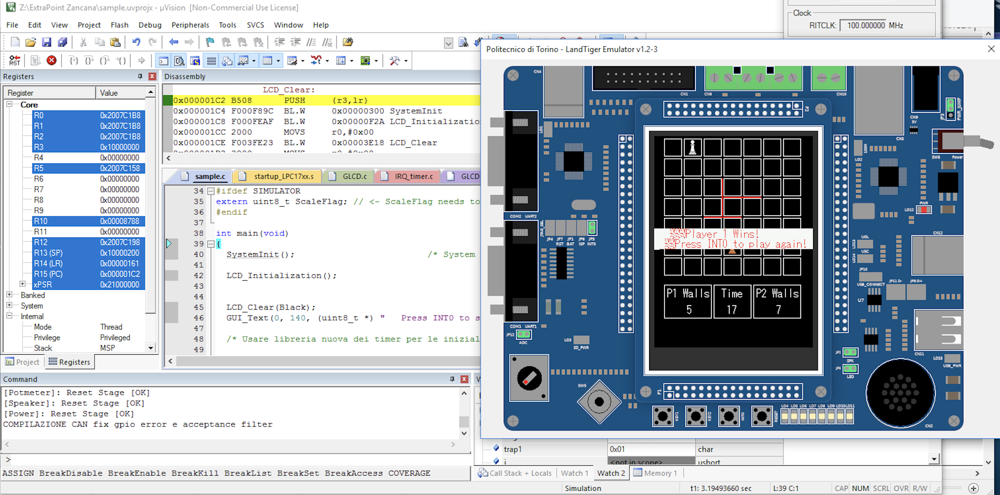

# Quoridor for LandTiger NXP LPC1768

Implementation of the **Quoridor board game** using C and ARM assembly for the **LandTiger NXP LPC1768** development board.

## 🧠 Project Overview

This project is a full implementation of the Quoridor strategy game, built for an embedded system based on the **LandTiger** development board featuring an **NXP LPC1768 (ARM Cortex-M3)** microcontroller.
This project was developed as part of the Computer Architecture course.

The game was developed and tested using:

- **Keil µVision IDE** (for writing and debugging)
- A **LandTiger emulator** (for PC-based development)
- The actual **LandTiger LPC1768 hardware board** (for flashing and real device testing)

Gameplay is rendered on the board’s built-in LCD display, and user input is handled via the physical buttons.

## 💻 Technologies Used

- **C** (main game logic and control flow)
- **ARM Assembly** (low-level functions and optimizations)
- **Keil µVision IDE**
- **LandTiger Emulator** (provided by Politecnico di Torino)
- **LandTiger LPC1768 development board**

## 🕹️ Controls

- **Directional buttons**: move the player
- **Center button**: place a wall
- **START/INT button**: start a new game

Each player has a limited number of walls. The goal is to reach the opposite side of the board before the opponent.

## 🚀 How to Run

1. Open the project with **Keil µVision**
2. Compile and run the code using either:
   - The **LandTiger Emulator** (for PC testing)
   - The **LandTiger board** (flash the binary via USB)
3. Use the board’s physical buttons to interact and play

> Make sure the necessary drivers and LandTiger libraries are properly installed in your Keil environment.
>

## 📷 Screenshot

